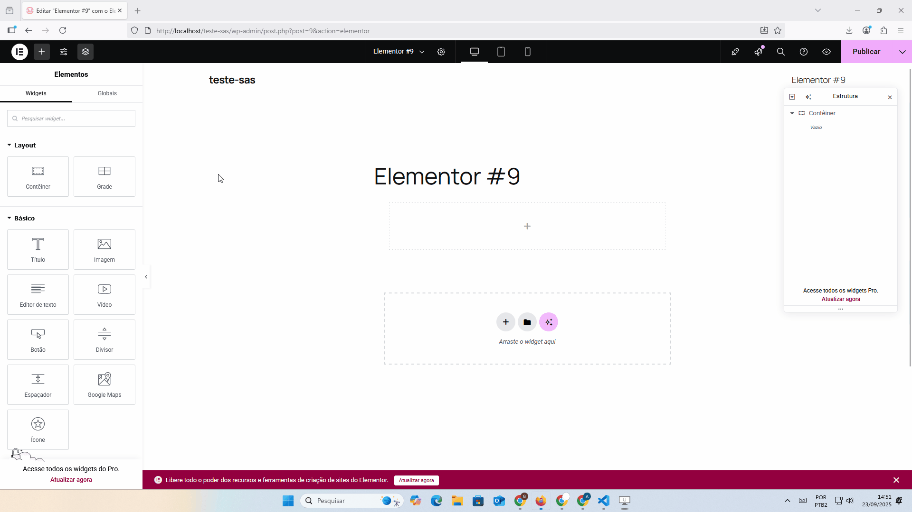

# Gerenciador de Arquivos WP

Um pequeno plugin WordPress/Elementor para facilitar a importação, exportação e gerenciamento de arquivos e documentos. O plugin também permite a visualização destes arquivos nas páginas do seu site, por meio de um widget que lista os documentos e oferece opção de download.

## Funcionalidades

- Importação e exportação de arquivos e documentos
- Gerenciamento de arquivos diretamente no painel do WordPress/Elementor
- Widget listar arquivos para download nas páginas

## Como instalar

### Instalação rápida via arquivo .zip (RECOMENDADO)


1. Faça o download do plugin em formato `.zip` por [este link](https://github.com/koohako/Gerenciador-de-arquivos-wp/releases/latest) (ou utilize o arquivo .zip disponível neste repositório).
2. No painel administrativo do WordPress, acesse **Plugins > Adicionar novo**.
3. Clique em **Fazer upload de plugin**.
4. Selecione o arquivo `.zip` baixado e clique em **Instalar agora**.
5. Após a instalação, clique em **Ativar plugin**.

### Instalação manual (via pasta)

1. Faça o download ou clone este repositório:
   ```bash
   git clone https://github.com/koohako/Gerenciador-de-arquivos-wp.git
   ```
2. Mova a pasta do plugin para o diretório `wp-content/plugins` do seu WordPress.
3. Ative o plugin pelo painel administrativo do WordPress.

## Como usar

- Gerencie seus arquivos, importe ou exporte documentos conforme necessário.


- Utilize o widget do Elementor para exibir a lista de arquivos em qualquer página do seu site.
- Para mostrar os arquivos da pasta desejada basta colocar o nome da pasta no campo "Pasta Base" (para subpastas deve-se escrever o caminho ex: "Pasta/subpasta").


## Requisitos

- WordPress instalado e funcionando
- Elementor instalado (caso deseje usar o widget)

## Contribuição

Contribuições são bem-vindas! Sinta-se à vontade para abrir issues ou enviar pull requests com melhorias.

## Licença

Este projeto está licenciado sob a GNU General Public License v3.0 (GPLv3). Veja o arquivo LICENSE para mais detalhes.
